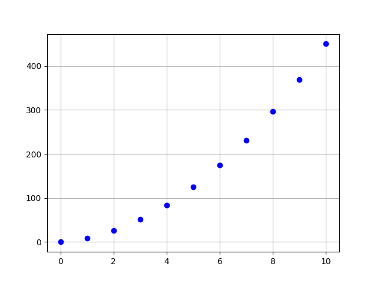
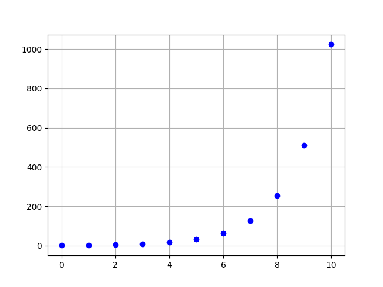

# Sequences
A python module built to use very easily explicit and recursive mathematic sequences.

## Installation and Import
1. Download the package file from the latest GitHub release and then `pip install [filename]`. Then, just `from sequences import *` in your code
2. Download the `__init__.py` rename it whatever you want and just `from [filenameWithoutDotPy] import *`

## Usage
### Explicit sequences
```python
from sequences import *

seq = ExplicitSequence('5*n+4*n**2')
```
This will create an explicit sequence with formula **5n+4n²**

**The range is always noted `n`**

Then to use it:
```python
terms = seq.exec(10, True)
print(terms)
```
The first line gets the terms until range `10` and shows a graph with the values and keys (`True`).
Here's the graph:



The second line will show the terms on the screen:
`{0: 0.0, 1: 9.0, 2: 26.0, 3: 51.0, 4: 84.0, 5: 125.0, 6: 174.0, 7: 231.0, 8: 296.0, 9: 369.0, 10: 450.0}`

### Recursive sequences
```python
from sequences import *

seq = sequences.ExplicitSequence('2*an')
```
This will create an explicit sequence with formula **2a<sub>n</sub>**

**The precedent term is always noted `an`**

Then to use it:
```python
terms = seq.exec(10, True)
print(terms)
```
The first line gets the terms of the sequence starting with the value `1` until range `10` and shows a graph with the values and keys (`True`).
Here's the graph:



The second line will show the terms on the screen:
`{0: 1, 1: 2.0, 2: 4.0, 3: 8.0, 4: 16.0, 5: 32.0, 6: 64.0, 7: 128.0, 8: 256.0, 9: 512.0, 10: 1024.0}`

## License
This project is under the MIT license. For more information, see [LICENSE](LICENSE)